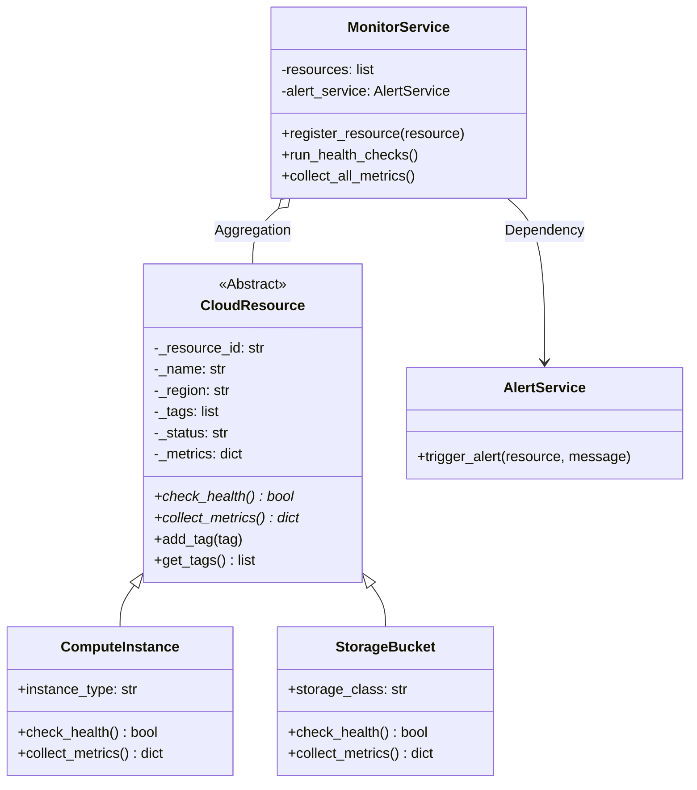
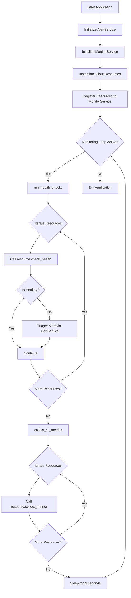
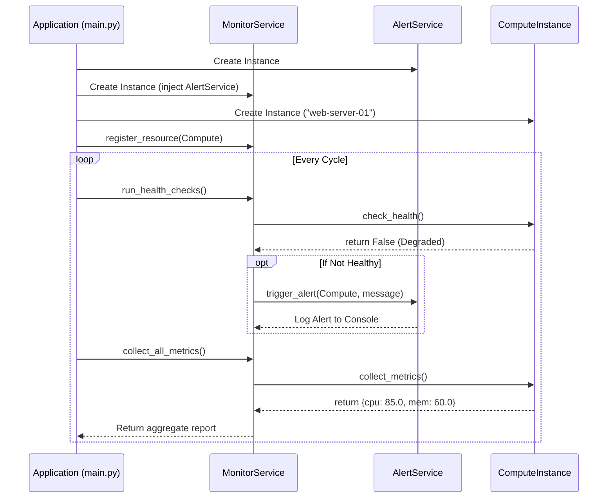
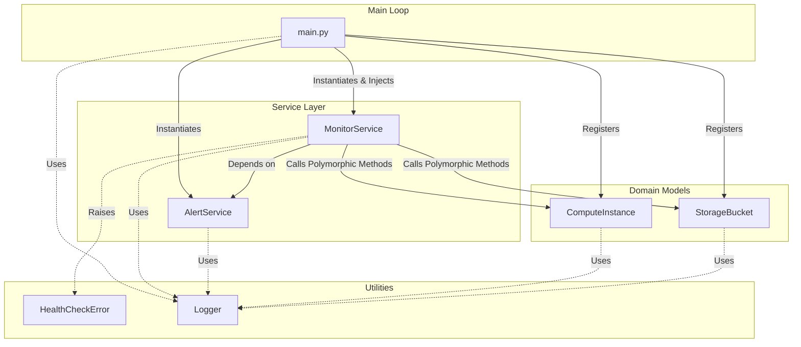
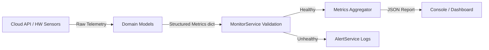

# 1. Project Title

**AetherWatch — An Object-Oriented Cloud Resource Monitoring Platform**

*Automating health checks and telemetry collection using a modular, robust, and extensible OOP architecture.*

---

# 2. Project Overview

In the modern era of cloud computing, organizations deploy thousands of infrastructure components, ranging from compute instances to object storage buckets, distributed across multiple regions and providers. As the scale of these deployments grows, ensuring the continuous health, availability, and optimal performance of every single resource becomes a monumental operational challenge. This is the precise domain where AetherWatch operates.

AetherWatch is an enterprise-grade cloud resource monitoring simulation platform designed to act as the central nervous system for cloud infrastructure. It continuously polls registered cloud assets, performs deep health checks, and collects vital telemetry data—all while orchestrating automated alerts for degraded systems. Rather than relying on disparate, monolithic scripts that are prone to failure and difficult to maintain, AetherWatch is engineered using strict Object-Oriented Programming (OOP) paradigms. It separates the concerns of data representation, health validation, metric collection, and alert dispatching into distinct, highly cohesive modules.

**Who would use it?**
The primary consumers of such a system are Cloud Infrastructure Engineers, Site Reliability Engineers (SREs), and DevOps teams. In a real-world scenario, these teams require a unified pane of glass to observe the operational state of their infrastructure. They need a system that can gracefully handle the addition of new, unforeseen resource types (such as serverless functions or managed databases) without requiring a complete rewrite of the core monitoring engine. AetherWatch provides exactly this level of extensibility.

**The Business Problem**
Downtime is incredibly expensive. When a critical compute instance fails or a storage bucket runs out of capacity, the ripple effects can take down entire customer-facing applications, resulting in lost revenue, diminished brand reputation, and SLA penalties. The business problem is fundamentally about *proactive visibility*. Without a system like AetherWatch, infrastructure failures are often discovered reactively—usually when a customer complains. AetherWatch solves this by providing continuous, automated observability, allowing engineering teams to identify and remediate failing components *before* they impact end-users.

**Real-world Applications**
In a production environment, an architecture identical to AetherWatch is used to build custom internal tooling that bridges the gap between different cloud providers (e.g., AWS, GCP, Azure). For example, a company might use a system like this to aggregate CPU utilization from AWS EC2 instances alongside read/write operations from GCP Cloud Storage buckets, normalizing the telemetry data into a single, cohesive dashboard. Furthermore, the alerting service pattern demonstrated here is universally used to route critical anomalies to incident management platforms like PagerDuty or Opsgenie.

**Why this problem matters**
As infrastructure continues to abstract into code and ephemeral services, the complexity of managing it increases exponentially. A monolithic monitoring script will collapse under the weight of this complexity. AetherWatch demonstrates that by applying software engineering best practices—specifically abstraction, polymorphism, and dependency injection—we can build a resilient monitoring framework that scales effortlessly with the business, ensuring operational excellence regardless of the infrastructure's underlying complexity.

---

# 3. Motivation Behind the Project

**Why this project was selected:**
Monitoring cloud resources is a universally understood problem in modern software engineering. It provides an excellent, practical context for demonstrating advanced programming concepts. Unlike theoretical examples (like generic "Animal" or "Vehicle" classes), modeling cloud resources directly mirrors the daily challenges faced by professional backend and platform engineers.

**Why OOP is beneficial for solving this problem:**
Cloud infrastructure is inherently object-oriented. A virtual machine is an object with state (running, stopped, terminated) and behavior (start, stop, reboot). A storage bucket is an object with capacity metrics and access policies. By utilizing Object-Oriented Programming, we can directly map these real-world domain entities to code structures. 

OOP allows us to establish a strong contract (via Abstraction) that guarantees every resource, no matter how different, will implement `check_health()` and `collect_metrics()`. It allows the core monitoring engine to treat all resources identically (via Polymorphism), drastically reducing code duplication and cyclic dependencies.

**Why companies architect such systems using classes and services:**
Enterprise engineering teams rely on Service-Oriented Architectures and strict class boundaries to enforce separation of concerns. The `MonitorService` doesn't need to know *how* a `ComputeInstance` checks its health; it only needs to know that it *can*. This decoupling means that a team working on adding a new `DatabaseResource` can do so independently, without touching the core monitoring loop, minimizing merge conflicts and regression bugs.

---

# 4. Features

| Feature Type | Description |
| :--- | :--- |
| **Functional** | **Automated Health Checks:** Continuously evaluates the operational status of heterogeneous cloud assets. |
| **Functional** | **Telemetry Collection:** Gathers specific metrics (CPU, Memory, IOPS, Capacity) based on the resource type. |
| **Functional** | **Alerting Engine:** Dispatches real-time alerts when a resource degrades or goes offline. |
| **Non-functional** | **Extensibility:** New resource types can be added by simply inheriting from `CloudResource` without modifying core logic. |
| **Non-functional** | **Modularity:** Strict separation between data models (`models/`) and business logic (`services/`). |
| **Non-functional** | **Robust Error Handling:** Custom domain exceptions ensure failures in one resource do not crash the entire monitor. |
| **Future Scalability** | **Multi-threading:** The health checks can be easily parallelized using Python's `concurrent.futures`. |
| **Future Scalability** | **Plugin Architecture:** The AlertService can be refactored into an interface supporting Slack, Email, and PagerDuty plugins. |

---

# 5. Complete System Architecture

```text
+-------------------------------------------------------------+
|                     User Application / CLI                  |
|                        (main.py)                            |
+------------------------------+------------------------------+
                               |
                               v
+-------------------------------------------------------------+
|                      Service Layer                          |
|                                                             |
|  +--------------------+             +--------------------+  |
|  |   MonitorService   |             |    AlertService    |  |
|  | (Orchestrates loop)| ----------> | (Routes anomalies) |  |
|  +---------+----------+             +--------------------+  |
|            |                                                |
+------------|------------------------------------------------+
             |
             v
+-------------------------------------------------------------+
|                       Domain Models                         |
|                                                             |
|                   +-------------------+                     |
|                   |   CloudResource   |                     |
|                   |  (Abstract Base)  |                     |
|                   +---------+---------+                     |
|                             |                               |
|            +----------------+---------------+               |
|            |                                |               |
|            v                                v               |
|  +-------------------+            +-------------------+     |
|  |  ComputeInstance  |            |   StorageBucket   |     |
|  | (CPU, Mem metrics)|            | (Capacity metrics)|     |
|  +-------------------+            +-------------------+     |
+-------------------------------------------------------------+
             |
             v
+-------------------------------------------------------------+
|                      Utility Layer                          |
|  +-------------------+            +-------------------+     |
|  | Custom Exceptions |            | Standard Logger   |     |
|  +-------------------+            +-------------------+     |
+-------------------------------------------------------------+
```

### Component Explanation:
1. **User Application (`main.py`)**: The entry point. It wires together the dependencies (Dependency Injection), registers the specific resources, and kicks off the monitoring loop.
2. **Service Layer**: Contains the business logic. `MonitorService` controls the flow of execution, while `AlertService` is responsible for side-effects (logging anomalies).
3. **Domain Models**: Contains the stateful representations of cloud infrastructure. `CloudResource` defines the absolute contract that concrete implementations (`ComputeInstance`, `StorageBucket`) must fulfill.
4. **Utility Layer**: Provides cross-cutting concerns like logging and domain-specific error types that are used globally across all layers.

---

# 6. UML Class Diagram

```text
+-----------------------------------------+
| <<Abstract>>                            |
| CloudResource                           |
+-----------------------------------------+
| - _resource_id: str                     |
| - _name: str                            |
| - _region: str                          |
| - _tags: list                           |
| - _status: str                          |
| - _metrics: Dict[str, float]            |
+-----------------------------------------+
| + resource_id(): str                    |
| + name(): str                           |
| + status(): str                         |
| + status(new_status: str): None         |
| + add_tag(tag: str): None               |
| + get_tags(): List[str]                 |
| + check_health()*: bool                 |
| + collect_metrics()*: Dict[str, float]  |
+-----------------------------------------+
                    ▲
                    |
      +-------------+-------------+
      |                           |
+--------------------+   +--------------------+
| ComputeInstance    |   | StorageBucket      |
+--------------------+   +--------------------+
| + instance_type    |   | + storage_class    |
+--------------------+   +--------------------+
| + check_health()   |   | + check_health()   |
| + collect_metrics()|   | + collect_metrics()|
+--------------------+   +--------------------+

+-----------------------------------------+
| MonitorService                          |
+-----------------------------------------+
| - resources: List[CloudResource]        |
| - alert_service: AlertService           |
+-----------------------------------------+
| + register_resource(res: CloudResource) |
| + run_health_checks()                   |
| + collect_all_metrics()                 |
+-----------------------------------------+
```

### Explanation of Concepts:
* **Inheritance**: `ComputeInstance` and `StorageBucket` inherit the base attributes (`_resource_id`, `_name`) and base methods (`add_tag`) from `CloudResource`, preventing code duplication.
* **Encapsulation**: Attributes like `_status` are protected. They can only be accessed or modified through the `@property` getters and setters, ensuring that invalid statuses (like "EXPLODED") cannot be assigned.
* **Abstraction**: `CloudResource` is defined with the `ABC` (Abstract Base Class) module. It cannot be instantiated directly. It forces subclasses to implement the abstract methods.
* **Polymorphism**: The `MonitorService` holds a list of `CloudResource` objects. It calls `.check_health()` on them blindly. The Python runtime dynamically resolves whether to execute the Compute logic or the Storage logic based on the actual object type at runtime.

---

# 7. Mermaid Class Diagram



---

# 8. System Flowchart (MANDATORY)



---

# 9. Sequence Diagram (MANDATORY)



### Sequence Explanation:
1. The **Application** creates the core services, explicitly injecting the `AlertService` into the `MonitorService`.
2. The **Application** creates domain models (like `ComputeInstance`) and passes their references to the `MonitorService`.
3. During the monitoring loop, the **MonitorService** requests a health status directly from the **ComputeInstance**.
4. If the instance evaluates itself as degraded, the **MonitorService** utilizes its dependency (**AlertService**) to dispatch a notification.
5. Finally, metrics are collected and aggregated back to the main loop.

---

# 10. Component Interaction Diagram



---

# 11. Data Flow Diagram



---

# 12. Folder Structure Explanation

```text
cloud_resource_monitor/
├── models/             # Contains all data models and entity definitions.
├── services/           # Contains business logic and orchestration controllers.
├── exceptions/         # Contains custom domain-specific error types.
├── tests/              # Contains all unit and integration test suites.
├── utils/              # Contains cross-cutting utilities like logging configurations.
├── main.py             # The application entry point and dependency root.
├── README.md           # The comprehensive project documentation.
└── debugging_report.md # Academic breakdown of a specific Python bug.
```

**Why professional teams organize projects this way:**
In enterprise software engineering, this structure enforces "Separation of Concerns." By isolating `models` from `services`, developers ensure that data representation logic doesn't bleed into business orchestration logic. This makes the codebase highly navigable. When an engineer needs to update how CPU is calculated, they know exactly to look in `models/`. If they need to change how alerts are dispatched, they look in `services/`. It heavily reduces cognitive load and allows massive teams to work on the same repository without stepping on each other's toes.

---

# 13. OOP Concepts Used

## Functions
**Purpose:** Functions group procedural steps into callable blocks. 
**Reusability & Modularity:** While OOP heavily relies on methods (functions bound to objects), standard functions (like `get_logger()` in `utils/logger.py`) provide modular, global utilities that don't logically belong to a specific domain state.

## Classes and Objects
**Real-world modeling:** A `class` acts as a blueprint, and an `object` is the concrete manifestation of that blueprint. In this project, `StorageBucket` is the class, representing the *concept* of cloud storage. `company-assets-bucket` is the instantiated object, representing a physical, specific storage container with real-time state.
**Responsibilities:** Classes encapsulate both state (metrics, status) and behavior (checking health), ensuring that operations on the data travel with the data itself.

## Encapsulation
**Private attributes & Accessors:**
Encapsulation hides the internal state of an object from the outside world. In `base_resource.py`, the status is stored as `self._status`. We expose it via a `@property` and a `@status.setter`.
```python
    @status.setter
    def status(self, new_status: str) -> None:
        valid_statuses = ["HEALTHY", "DEGRADED", "OFFLINE", "UNKNOWN"]
        if new_status not in valid_statuses:
            raise ValueError(f"Invalid status: {new_status}")
        self._status = new_status
```
**Benefits:** This validation logic ensures that no other part of the system can accidentally corrupt the resource's state by setting the status to "BROKEN". It enforces data integrity.

## Abstraction
**Abstract base classes & Contracts:**
Abstraction hides complex implementation details and exposes only a clean, high-level interface. `CloudResource` inherits from `ABC` and uses `@abstractmethod`.
```python
    @abstractmethod
    def check_health(self) -> bool:
        pass
```
**Benefits:** This creates a strict contract. It guarantees to the `MonitorService` that *any* resource passed to it will absolutely have a `check_health` method, removing the need for brittle `hasattr` checks.

## Inheritance
**Parent-child relationships:**
`ComputeInstance` inherits from `CloudResource`.
**Code reuse:** Because of inheritance, `ComputeInstance` automatically receives the `name`, `resource_id`, and `tags` attributes, as well as the encapsulation logic for `status`, without having to write a single line of that code again.

## Polymorphism
**Method overriding & Runtime flexibility:**
Polymorphism allows objects of different classes to be treated as objects of a common superclass. 
In `MonitorService`:
```python
        for resource in self.resources:
            is_healthy = resource.check_health()
```
**Benefits:** The `MonitorService` does not know if `resource` is a Compute instance or a Storage bucket. It doesn't care. It simply invokes `check_health()`, and Python dynamically executes the heavily customized, overriding method specific to that exact child class at runtime. This eliminates massive `if/else` statements.

---

# 14. Design Patterns (If Applicable)

### Dependency Injection
**Why it was selected:** Rather than having `MonitorService` instantiate its own `AlertService` internally, the `AlertService` is passed (injected) into the constructor.
```python
def __init__(self, alert_service: AlertService):
    self.alert_service = alert_service
```
**Industry use cases:** This is a critical pattern for testability. In our unit tests, we can inject a "MockAlertService" that simply records calls rather than actually dispatching emails or PagerDuty alerts, allowing tests to run entirely in isolation.

---

# 15. Debugging Documentation

The project includes an intentionally planted, highly notorious Python bug: **Shared Mutable Object References** via mutable default arguments in `base_resource.py` (`def __init__(..., tags: list = []):`). 

Because Python evaluates default arguments exactly once at function definition time, all instances instantiated without explicit tags end up pointing to the exact same list object in memory. Modifying one modifies all.

For a comprehensive breakdown of the bug, the memory model implications, and the industry-standard fix, please refer to the dedicated **[`debugging_report.md`](debugging_report.md)** file in this repository.

---

# 16. Screenshots Section

*(In a deployed GitHub environment, actual PNG/JPG files would be linked here)*

[Application Home Screen]
> *Screenshot showing the initial boot sequence of AetherWatch in the terminal.*

[Bug Demonstration]
> *Screenshot showing `db_server` unexpectedly receiving tags intended only for `web_server` due to the mutable default argument bug.*

[Debugger Output]
> *Screenshot of a VS Code / PyCharm debugger showing the identical memory addresses of `self._tags` across multiple distinct objects.*

[Fixed Execution]
> *Screenshot showing independent tag lists after applying the `tags=None` fix.*

[Class Diagram Screenshot]
> *Rendered view of the Mermaid class diagram.*

[Flowchart Screenshot]
> *Rendered view of the operational flowchart.*

---

# 17. Installation Guide

### Prerequisites
* **Python Version:** Python 3.8 or higher.
* **OS:** Windows, macOS, or Linux.

### Setup Instructions
1. **Clone the repository:**
   ```bash
   git clone https://github.com/your-org/aetherwatch.git
   cd aetherwatch
   ```
2. **Create a Virtual Environment (Optional but recommended):**
   ```bash
   python -m venv venv
   source venv/bin/activate  # On Windows use: venv\Scripts\activate
   ```
3. **Dependencies:**
   This project relies entirely on the Python Standard Library. No external dependencies (like `pip install requirements.txt`) are required.

### Execution
Run the main application simulation:
```bash
python main.py
```

---

# 18. Usage Examples

**Example 1: Running the Core Loop**
When you execute `python main.py`, the system registers three dummy resources (two compute, one storage). It then simulates two monitoring cycles.
**Expected Output:**
```text
2026-06-29 15:26:01 - INFO - --- Monitoring Cycle 1 ---
2026-06-29 15:26:01 - INFO - Checking health for ComputeInstance web-server-01...
2026-06-29 15:26:01 - WARNING - ALERT [i-0abcdef1234567890]: Health check failed. Status is OFFLINE
2026-06-29 15:26:01 - INFO - Metrics for web-server-01: {'cpu_utilization': 78.87, ...}
```
**Execution Flow:** The system initializes, begins the loop, delegates health checks polymorphically, triggers the AlertService upon detecting failures, and finally aggregates randomized metrics.

---

# 19. Testing Strategy

The project utilizes Python's built-in `unittest` framework to guarantee the reliability of the OOP architecture.
* **Unit Tests:** Located in `tests/test_monitor.py`. These tests instantiate the models and services in isolation.
* **Edge Cases:** Tests are designed to verify that the `MonitorService` can handle an empty resource list gracefully.
* **Validation Tests:** Tests explicitly interact with the `@status.setter` property to ensure that invalid string assignments raise `ValueError` as designed.

**To run the test suite:**
```bash
python -m unittest discover tests/
```

---

# 20. Future Improvements

* **Short-term improvements:** Implement `dataclasses` for the metrics payloads to enforce strict type hinting rather than relying on standard dictionaries.
* **Long-term enterprise improvements:** Decouple the monitoring loop into an asynchronous architecture using Python's `asyncio` to allow concurrent polling of thousands of resources simultaneously.
* **Cloud deployment possibilities:** Containerize the application using Docker, allowing it to be deployed as a continuously running Kubernetes Deployment or Nomad job.
* **Database integration possibilities:** Replace the in-memory `metrics` dictionary with a time-series database adapter (like Prometheus or InfluxDB) for persistent telemetry storage.
* **REST API possibilities:** Wrap the `MonitorService` in a FastAPI or Flask application, allowing external systems to query the real-time health of the infrastructure via HTTP GET requests.

---

# 21. Industry Perspective: How Professional Software Teams Use These OOP Concepts

In professional software engineering environments, the Object-Oriented paradigms demonstrated in this project are not merely academic exercises; they are critical survival mechanisms for managing the immense complexity of enterprise applications. When a codebase grows to hundreds of thousands of lines of code, contributed to by dozens of developers simultaneously, strict architectural boundaries are the only thing preventing total systemic collapse.

### Encapsulation in Large Systems
In this project, encapsulation was demonstrated by protecting the `_status` attribute of a cloud resource. In a massive enterprise system, encapsulation is the foundation of domain-driven design. Imagine a financial system processing millions of transactions. If the `account_balance` variable was public and directly mutable, any junior developer writing a new feature could accidentally increment or decrement it improperly, bypassing validation rules, audit logs, and transaction safety checks. By fiercely encapsulating data and forcing state changes through controlled setter methods, teams ensure that invariants are always maintained. If a bug occurs, developers know exactly which method to audit, rather than hunting through the entire repository to find where a variable was modified.

### Abstraction in Frameworks
Abstraction is the cornerstone of how massive tech companies build internal platforms. In this project, `CloudResource` is an abstract base class. In reality, cloud providers release new services constantly. If an infrastructure team at a company like Netflix relies on a monolithic script to monitor their systems, they would have to rewrite their core monitoring loop every time AWS releases a new database type. By relying on Abstractions (or Interfaces in languages like Java/Go), the core platform engine is completely decoupled from the specific implementation details of the resources it manages. The core engine is programmed against the *contract* (e.g., "I can ask this thing for its health"), not the *implementation* (e.g., "I know exactly how to ping this specific Postgres database").

### Inheritance in Enterprise Applications
Inheritance is used strategically in the industry to enforce DRY (Don't Repeat Yourself) principles, though it is often used sparingly in favor of composition. In our architecture, inheritance allowed `ComputeInstance` and `StorageBucket` to share IDs, names, and tagging logic. In enterprise systems, you will frequently see deep inheritance hierarchies in UI frameworks (where every button and text box inherits from a base `Widget` class) or ORM frameworks (where every database model inherits from a base `Model` class that provides save/load functionality). This ensures absolute consistency across the application surface.

### Polymorphism in Plugin Architectures
Polymorphism is perhaps the most heavily utilized OOP concept in scalable software. It is the mechanism that enables "Plugin Architectures." Consider the `MonitorService` checking the health of a list of resources. Because of polymorphism, a team can develop a brand new `ServerlessFunctionResource` class, drop it into the system, and the `MonitorService` will monitor it perfectly without a single line of its code being changed. This adherence to the Open-Closed Principle (software entities should be open for extension, but closed for modification) allows massive applications like IDEs (VS Code), web browsers, and monitoring systems (Datadog) to support thousands of third-party plugins safely.

### Debugging Methodologies in Software Companies
The mutable default argument bug highlighted in this project is a rite of passage for Python developers. In professional settings, discovering and fixing bugs relies heavily on deterministic methodologies. Engineers do not simply guess; they rely on step-through debuggers, extensive unit test suites, and strict CI/CD pipelines. Furthermore, professional teams employ static analysis tools (like `mypy`, `pylint`, or `flake8`) that automatically scan code during the Pull Request phase to detect and reject patterns like mutable defaults before they ever reach production.

### Documentation Standards in Real Engineering Teams
Finally, documentation like this README is considered a first-class citizen in real engineering teams. Code without documentation is a liability. Professional documentation serves to onboard new engineers rapidly, explain the architectural *intent* (the "why", not just the "how"), and provide operational runbooks for when the system inevitably fails at 3:00 AM. A repository that beautifully marries clean code with comprehensive, architectural documentation is the hallmark of a mature, high-performing engineering culture.

---

# 22. Learning Outcomes

This project serves as a comprehensive masterclass in applied software engineering. Through its construction, it demonstrates:
* **Software Engineering:** The transition from writing simple scripts to designing modular, service-oriented architectures.
* **OOP:** Deep, practical application of Encapsulation, Abstraction, Inheritance, and Polymorphism in a realistic cloud domain.
* **Debugging:** Forensic identification and remediation of deep memory-reference bugs in Python.
* **Maintainability:** How strict contracts and separation of concerns make codebases resilient to change and easy to navigate.
* **Scalability:** Designing core loops that are agnostic to the number or type of underlying components they process.
* **Clean Architecture:** Proving that beautifully structured, well-documented code is just as important as the functional execution itself.
